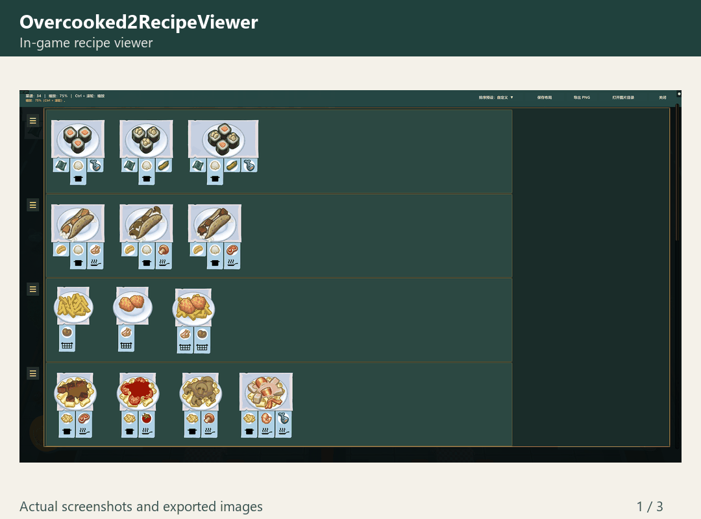

# Overcooked2RecipeViewer

简体中文 | [English](#english)

一个基于 BepInEx 的《胡闹厨房 2》（Overcooked! 2）菜谱查看 Mod。使用游戏原版菜谱卡片展示当前关卡的全部可用菜谱，方便提前查看、整理和分享。

**这是菜谱查看、排列和分享工具，仅调整查看器中的显示与布局，不改变游戏实际订单、订单生成逻辑、出菜顺序、计时或得分。**

[游戏内截图](docs/screenshots/recipe-viewer.png) · [组合套餐导出](docs/screenshots/exported-combo-meals.png) · [完整菜谱图](docs/screenshots/exported-recipes.png)

## 兼容要求

- Windows / Steam 版 **Overcooked! 2**（Mono）。
- **BepInEx 5**（[官方下载](https://github.com/BepInEx/BepInEx/releases/tag/v5.4.23.2) · [官方安装说明](https://docs.bepinex.dev/articles/user_guide/installation/index.html)）。
- 当前本地构建环境：Steam Build ID `20236421`，BepInEx `5.4.23.1`。

## 功能

- 支持官方关卡，以及提供游戏标准菜谱数据的自制地图。
- 查看当前关卡的菜谱，支持按厨具排序等多种排列方式。
- 拖拽调整菜谱位置和整行顺序，自由整理布局。
- 自动保存各关卡的自定义布局，也可保存和切换多份布局。
- 支持滚动、缩放，以及完整菜谱图的 PNG 导出和剪贴板复制。
- 根据游戏语言自动使用中文或英文界面。

## 使用

安装 BepInEx 5 后，从 [最新 Release 下载 ZIP 压缩包](https://github.com/foamp/Overcooked2RecipeViewer/releases/latest)，解压后推荐放在游戏目录下的 `BepInEx\plugins\Overcooked2RecipeViewer\Overcooked2RecipeViewer.dll`。

BepInEx 会扫描 `plugins` 及其子目录；本项目推荐使用独立的 `Overcooked2RecipeViewer` 文件夹，方便管理。

进入厨房关卡后即可打开查看器，使用工具栏选择排序方式、保存布局和导出图片。配置管理器中的插件名称为 **Overcooked2RecipeViewer**。

## 快捷操作

| 操作 | 按键 / 鼠标 |
| --- | --- |
| 显示 / 关闭查看器 | **Insert**（默认，可在配置中修改） |
| 纵向滚动 | **鼠标滚轮** / **PageUp、PageDown** |
| 横向滚动 | **Shift + 滚轮** |
| 缩放（50%–200%） | **Ctrl + 滚轮** |
| 移动菜谱 | 拖拽菜谱卡片 |
| 移动整行 | 拖拽行左侧的把手 |

## 问题反馈

遇到问题请前往 [Issues](https://github.com/foamp/Overcooked2RecipeViewer/issues)，附上游戏与 Mod 版本、关卡及人数、复现步骤，以及 `BepInEx\LogOutput.log` 中的相关日志；界面问题可附截图。

## 开发

构建与开发说明请参阅 [开发指南](docs/DEVELOPMENT.md)。

## 致谢

感谢 **GPT** 在这个 Mod 的开发、调试和功能完善过程中提供的帮助。

本项目代码采用 [MIT License](LICENSE)。游戏及其美术资源归各自权利人所有。

---

## English

[简体中文](#overcooked2recipeviewer) | English

A BepInEx mod for **Overcooked! 2** that displays all available recipes in the current level using the game's original recipe cards. Preview, arrange, and share your recipe board.

**This is a recipe viewing, arrangement, and sharing tool. It only changes the viewer's display and layout; it does not change actual orders, order generation, serving order, timers, or scoring.**

The GIF above shows the in-game viewer and PNG exports using existing screenshots.

### Requirements

- **Overcooked! 2** for Windows / Steam (Mono).
- **BepInEx 5** ([official download](https://github.com/BepInEx/BepInEx/releases/tag/v5.4.23.2) · [official installation guide](https://docs.bepinex.dev/articles/user_guide/installation/index.html)).
- Current local build environment: Steam Build ID `20236421`, BepInEx `5.4.23.1`.

### Features

- Supports official levels and custom maps that expose the game's standard recipe data.
- View the current level's recipes, with cookware sorting and other arrangement options.
- Drag recipe cards and entire rows to customize the layout.
- Automatically save custom layouts for each level, with support for saving and switching between multiple layouts.
- Scroll, zoom, export the complete recipe board as a PNG, and copy it to the clipboard.
- Automatically use Chinese or English UI based on the game's language.

### Usage

Install BepInEx 5, [download the ZIP archive from the latest release](https://github.com/foamp/Overcooked2RecipeViewer/releases/latest), and extract the DLL to the recommended location under the game directory: `BepInEx\plugins\Overcooked2RecipeViewer\Overcooked2RecipeViewer.dll`.

BepInEx scans `plugins` and its subdirectories; a separate `Overcooked2RecipeViewer` folder keeps this mod easy to manage.

Enter a kitchen level to open the viewer. Use its toolbar to choose a sorting preset, save layouts, and export images. In Configuration Manager, the plugin is listed as **Overcooked2RecipeViewer**.

### Controls

| Action | Key / mouse |
| --- | --- |
| Show / hide the viewer | **Insert** (default; configurable) |
| Scroll vertically | **Mouse wheel** / **PageUp, PageDown** |
| Scroll horizontally | **Shift + mouse wheel** |
| Zoom (50%–200%) | **Ctrl + mouse wheel** |
| Move a recipe | Drag its card |
| Move an entire row | Drag the handle at the row's left edge |

### Bug reports

Please open an [Issue](https://github.com/foamp/Overcooked2RecipeViewer/issues) with your game and mod versions, level and player count, reproduction steps, and relevant entries from `BepInEx\LogOutput.log`. Include a screenshot for visual issues.

### Development

See the [Development Guide](docs/DEVELOPMENT.md) for build and development instructions.

### Acknowledgements

Thanks to **GPT** for helping with the development, debugging, and refinement of this mod.

This project's code is licensed under the [MIT License](LICENSE). The game and its artwork belong to their respective rights holders.
