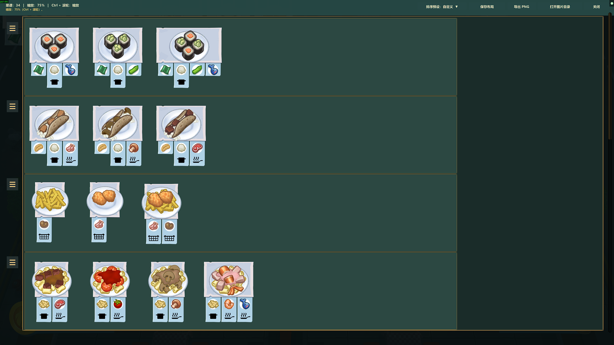

# Overcooked2RecipeViewer

一个基于 BepInEx 的《胡闹厨房 2》（Overcooked! 2）菜谱查看 Mod。使用游戏原版菜谱卡片展示当前关卡的全部可用菜谱，方便提前查看、整理和分享。

## 功能

- 查看当前关卡的菜谱，支持按厨具排序等多种排列方式。
- 拖拽调整菜谱位置和整行顺序，自由整理布局。
- 自动保存各关卡的自定义布局，也可保存和切换多份布局。
- 支持滚动、缩放，以及完整菜谱图的 PNG 导出和剪贴板复制。
- 根据游戏语言自动使用中文或英文界面。

## 使用

安装 BepInEx 5 后，从 [发布页面下载 ZIP 压缩包](https://github.com/foamp/Overcooked2RecipeViewer/releases)，解压后将 `Overcooked2RecipeViewer.dll` 放入游戏的 `BepInEx\plugins` 文件夹。

进入厨房关卡后，按 **Insert** 显示或关闭菜谱。**Ctrl + 滚轮** 缩放，**Shift + 滚轮** 横向滚动。界面中可选择排序方式、保存布局和导出图片。

## 致谢

感谢 **GPT** 在这个 Mod 的开发、调试和功能完善过程中提供的帮助。

本项目代码采用 [MIT License](LICENSE)。游戏及其美术资源归各自权利人所有。

---

## English

A BepInEx mod for **Overcooked! 2** that displays all available recipes in the current level using the game's original recipe cards. Preview, arrange, and share your recipe board.

### Features

- View the current level's recipes, with cookware sorting and other arrangement options.
- Drag recipe cards and entire rows to customize the layout.
- Automatically save custom layouts for each level, with support for saving and switching between multiple layouts.
- Scroll, zoom, export the complete recipe board as a PNG, and copy it to the clipboard.
- Automatically use Chinese or English UI based on the game's language.

### Usage

Install BepInEx 5, [download the ZIP archive from the releases page](https://github.com/foamp/Overcooked2RecipeViewer/releases), extract it, and place `Overcooked2RecipeViewer.dll` in the game's `BepInEx\plugins` folder.

Enter a kitchen level and press **Insert** to show or hide the recipe board. Use **Ctrl + mouse wheel** to zoom and **Shift + mouse wheel** to scroll horizontally. The viewer includes controls for sorting, saving layouts, and exporting images.

### Acknowledgements

Thanks to **GPT** for helping with the development, debugging, and refinement of this mod.

This project's code is licensed under the [MIT License](LICENSE). The game and its artwork belong to their respective rights holders.
