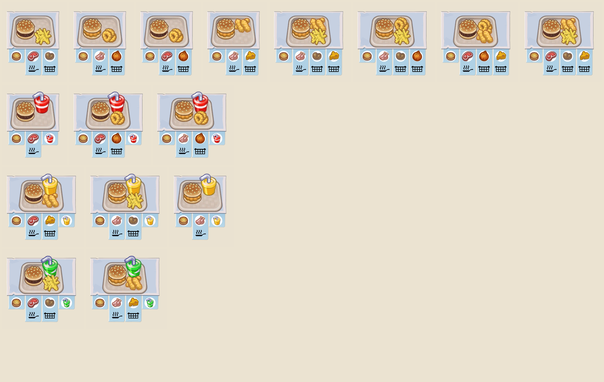
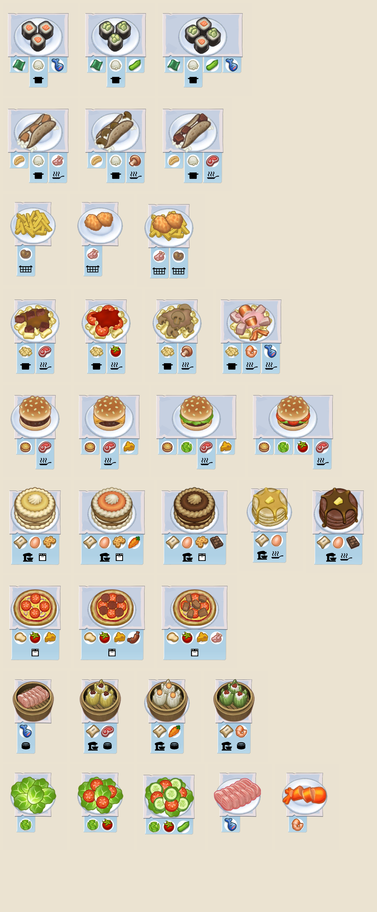

# Overcooked2RecipeViewer

A BepInEx mod for **Overcooked! 2** that shows the recipes available in the current level using the game's own recipe cards. Arrange your menu, keep custom layouts, and export a complete recipe sheet as a PNG.

[Download v0.8.3](https://github.com/foamp/Overcooked2RecipeViewer/releases/tag/v0.8.3)


The viewer changes only the recipe preview. It does not change the game's real orders, order generation, timers or scoring.

## Features

- View the level's recipe pool with the original recipe card artwork.
- Choose **Original order**, **Auto arrange**, **Name A-Z** or **Cookware** from the Preset menu.
- Drag recipes within or between rows, drop between rows to create a row, or use the left handle to move an entire row.
- Scroll vertically and horizontally; zoom from **50% to 200%** with Ctrl + mouse wheel.
- Automatically save the last edited layout for each level and restore it after reopening or restarting the game.
- Save named layout snapshots, switch between them in Preset, and delete a snapshot with its **X** button.
- Export the complete arrangement as a PNG, including recipes outside the visible area, and copy the image to the Windows clipboard when available.
- Use Chinese UI when the game language is Chinese (including the Traditional Chinese setting); use English UI for all other game languages.

## Requirements

- **Overcooked! 2 for Windows**, using the game's Mono runtime. This mod targets Overcooked! 2, not Overcooked! All You Can Eat.
- **BepInEx 5** installed for your game. The local build environment uses BepInEx 5.4.23.1 and Harmony 2.9.0.0. BepInEx 6 / IL2CPP builds are not supported by this build.
- Optional: **BepInEx Configuration Manager** to change the toggle shortcut in-game. It is not required to open the viewer.

Game assemblies and BepInEx binaries are not included in this repository or the mod download.

## Installation

1. Install BepInEx 5 for your copy of Overcooked! 2. If necessary, run the game once to let BepInEx create its folders, then close it.
2. Download `Overcooked2RecipeViewer.dll` from the [v0.8.3 release](https://github.com/foamp/Overcooked2RecipeViewer/releases/tag/v0.8.3), or [build it from source](#building).
3. Create a folder named `Overcooked2RecipeViewer` inside the game's `BepInEx\plugins` directory.
4. Place the DLL in that folder:

   ```text
   <game-directory>\BepInEx\plugins\Overcooked2RecipeViewer\Overcooked2RecipeViewer.dll
   ```

5. Start the game, enter a kitchen level, and press **Insert**.

### Upgrading from RecipePreview

Close the game and remove the previously installed **`Overcooked2RecipePreview.dll`** before installing the renamed DLL. Keep only one copy of this mod anywhere under `BepInEx\plugins`; the two filenames use the same plugin identity.

Keep your existing configuration and layouts. The old internal storage names are deliberately retained, so your shortcut and saved layouts continue to work:

- Configuration: `BepInEx\config\io.github.overcooked2.recipepreview.cfg`
- Layouts: `%APPDATA%\Overcooked2RecipePreview\layouts.txt`
- PNG exports: `BepInEx\RecipePreviewExports`

## Usage

| Action | Control |
| --- | --- |
| Show / hide the viewer | **Insert**, or your configured shortcut |
| Scroll vertically | Mouse wheel, right scrollbar, **PageUp / PageDown** |
| Scroll horizontally | **Shift + mouse wheel**, or bottom scrollbar |
| Zoom | **Ctrl + mouse wheel** |
| Choose a sorting method or saved layout | **Preset** |
| Move a recipe | Drag its card |
| Create a new row | Drop a card in the narrow highlighted gap between two rows |
| Reorder a whole row | Drag the handle at the row's left edge |
| Save a layout snapshot | **Save layout** |
| Delete a saved snapshot | **X** beside that snapshot in Preset |
| Export the full arrangement | **Save PNG** |
| Open the export folder | **Open PNG folder** |

For a level with no edited layout, **Cookware** is the default. Once you drag a recipe or row, the arrangement becomes **Custom** and is saved automatically. The next opening restores that level's last edited layout. Choosing another preset or saved snapshot does not overwrite that custom draft; further dragging updates it.

**Save layout** creates a separate snapshot named Saved 1, Saved 2, and so on. Deleting a snapshot does not delete the automatic draft or other levels' layouts.

The toggle shortcut appears under **Overcooked2RecipeViewer** in Configuration Manager. English labels are `Keyboard shortcuts` / `Toggle all recipe images`; Chinese game settings use translated display labels. The underlying configuration keys remain compatible with earlier versions.

## Screenshots

The in-game viewer is shown at the top of this page. These PNG examples were exported directly from user-arranged recipe boards.

### Combo meal export



<details>
<summary>View a complete exported recipe sheet</summary>



</details>

## Building

Building requires **Windows PowerShell 5.1 or newer**, the **.NET Framework 3.5 C# compiler tools**, and your own game installation with BepInEx 5 installed.

From the repository root:

```powershell
.\build.ps1 -GameDir '<game-directory>'
```

Replace `<game-directory>` with the folder containing `Overcooked2_Data` and `BepInEx`. The script reads dependencies from that installation and writes:

```text
artifacts\Overcooked2RecipeViewer.dll
```

You can also set `$env:OC2_GAME_DIR` for your PowerShell session, then run `.\build.ps1`. Use `-CompilerPath '<path-to-csc.exe>'` if the .NET Framework 3.5 compiler is in a different location. Preserve the game's older runtime target when choosing another compiler.

Building does not install the mod. For a deployment preview and then an explicit installation:

```powershell
.\deploy.ps1 -GameDir '<game-directory>' -WhatIf
.\deploy.ps1 -GameDir '<game-directory>'
```

The default destination is `BepInEx\plugins\Overcooked2RecipeViewer` inside the selected game. `-PluginDir '<plugin-subdirectory>'` can select another folder under that game's `BepInEx\plugins`. The script refuses missing/empty build output, unsafe destinations and duplicate installations. It copies only the compiled mod DLL and does not start the game or delete other files.

See [docs/DEVELOPMENT.md](docs/DEVELOPMENT.md) for implementation details, compatibility identifiers and regression checks.

## Known Issues

- **Name A-Z** uses internal recipe resource names, not localized dish names. **Auto arrange** retains the existing resource-name grouping rules and may group custom recipes imperfectly.
- Cookware groups are based on available cooking metadata. Unknown or modded steps may fall into a broad/unknown group; recipes using multiple cooking devices form a combined group.
- Compatibility with every custom level mod is not guaranteed. A level that provides incomplete recipe data may produce an incomplete preview.
- Zoom is remembered during the current game session and resets to 100% after restarting. PNG export uses the normal scale.
- Zoom is unavailable while dragging, exporting, or using an open Preset menu.
- Very large boards can exceed the export safety limits. If clipboard transfer fails, the saved PNG remains available; clipboard images may be reduced in size.
- The viewer needs an active kitchen level and the game's recipe UI. It is not a recipe browser for the main menu.

For troubleshooting, check `BepInEx\LogOutput.log`. When opening an issue, include the mod version, level/player count, reproduction steps, relevant log excerpt and a screenshot if helpful. Remove private information from attachments before sharing them.

## 简体中文

这是胡闹厨房 2 的菜谱查看 Mod，可显示当前关卡全部可用菜谱，支持按厨具排序、拖拽调整、自定义布局保存和 PNG 导出，不改变真实订单与得分逻辑。

安装 BepInEx 5 后，将 `Overcooked2RecipeViewer.dll` 放入游戏的 `BepInEx\plugins\Overcooked2RecipeViewer` 文件夹。进入厨房后按 **Insert** 开关菜单，**Shift + 滚轮** 横向滚动，**Ctrl + 滚轮** 缩放。游戏语言为中文时，Mod 界面自动使用中文。

从旧版升级时请先移除旧的 `Overcooked2RecipePreview.dll`，不要同时安装两个版本。保留原来的配置和布局文件即可继续使用。

## License

This project's source code is licensed under the [MIT License](LICENSE).

Overcooked! 2, its artwork and game assets belong to their respective rights holders. The MIT license covers this mod's code, not the game or its assets. No game binaries or original resources are distributed here.
